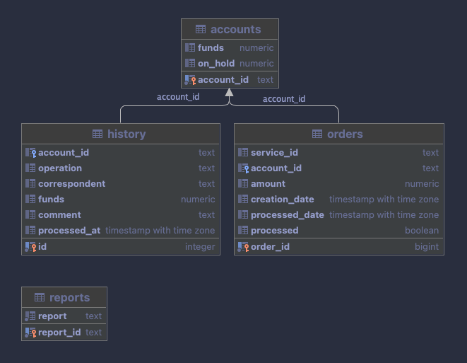

# Balance microservice
## Description
Микросервис для работы с балансом пользователей.

Сервис может вывести, зачислить, снять, зарезервировать, перевести средства и создать отчет по услугам по соответствующим хендлерам.

Реализована трехслойная архитектура `handler` -> `action` -> `storage`. 
Чтобы слои имели меньшее зацепление, все передается через интерфейс слоя.
Сервис также способен читать и писать запросы в gzip через `middleware`.

## Endpoints

Подробное описание всех эндпоинтов есть в файле [openapi.json](/swagger/openapi.json).  
Здесь приведено короткое описание.

### Balance endpoints

- `GET /balance/get/{account_id}`  
  - Хэндлер для получения текущего баланса на аккаунте.  
  - Проверяет `account_id` и если таковой аккаунт существует, выдает информацию о нем.


- `POST /balance/add`  
  - Хэндлер для начисления средств на аккаунт.  
  - В случае если аккаунта не существует, создаст аккаунт и зачислит средства.


- `POST /balance/transfer`  
  - Хэндлер для передачи средств с аккаунта на аккаунт.  
  - Проверяет есть ли средства у отправителя, затем перечисляет средства.  
  - В случае если аккаунта не существует, создаст аккаунт и зачислит средства.


### Order endpoints

- `POST /order/reserve`  
  - Хэндлер для создания нового заказа и резервирования средств на аккаунте.  
  - Проверяет есть ли средства у покупателя, затем замораживает их и создает необработанный заказ.
  - Номер заказа должен подходить под алгоритм Луна, чтобы в случае, когда приходят неверные данные, система не проверяла их в базе.


- `POST /order/withdraw`  
  - Хэндлер для одобрения операции списания средств за заказ.  
  - Работает только с необработанными заказами, второй раз списать средства не получится.  
  - Замороженные средства списываются, заказ отмечается как обработанный.
  - Также на входе проверяется по алгоритму Луна.


- `POST /order/cancel`  
  - Хэндлер для отмены заказа.  
  - Работает только с необработанными заказами, второй раз отменить не получится.  
  - Замороженные средства обратно зачисляются на счет, заказ удаляется.
  - Также на входе проверяется по алгоритму Луна.

### Reports endpoints

- `POST /accounting/add`  
  - Хэндлер для создания отчета по операциям за отчетный период.  
  - Проверяет по хэшу есть ли отчет за нужный период и возвращает ссылку на него, если он есть.  
  - В случае если отчета не существует, создает отчет и так же возвращает на него ссылку.


- `POST /accounting/get/{report_id}`
  - Хэндлер для получения отчета по операциям за отчетный период.  
  - Проверяет `report_id` существует ли отчет и возвращает отчет в формате CSV.


## Deploy

Все параметры сервиса и базы данных берутся из переменных окружения.  
Окружение задается файлом [.env](.env).

Запустить контейнеры с сервисом и с базой данных можно командой:
```sh 
$ make compose
```

Остановка контейнеров:
```sh
$ make compose-down
```

Для того чтобы запустить приложение не используя Docker, необходимо подтянуть зависимости и запустить с флагами:
```sh
$ go run cmd/main.go -a <port> -d <postgres URI>
```
Без флага `-a` запустится на порте `:8080`. Также эти параметры можно задать через переменные окружения: `RUN_ADDRESS` и `DATABASE_URI`.

## Обоснование архитектуры

Все части сервиса заменяемы благодаря архитектуре.   
Каждая часть просто должна подходить под нужный [интерфейс](/internal/interfaces/interfaces.go).  

Таким образом была максимально уменьшена связность компонентов в системе.

Далее приведены обоснования разных моментов, которые можно заметить в сервисе.

### Много проверочных методов в хранилище
В пакете `storage` можно заметить много разных методов проверки с возвращением переменных и без этого.  
Делалось это с мыслью о будущем совершенствовании сервиса, когда нужно будет написать метод к имеющимся типам операций.

### Хэш как ID бухгалтерского отчета
Проще всего было сделать инкрементальный ID или вместо него писать расчетный период.
Однако таким образом понятна структура хранения отчетностей в базе.  

Имплементирован конечно только один тип отчета, но что если отчет должен увидеть только один человек?  
В случае с инкрементальной системой можно написать любое число в URL и получить любой отчет. С датами аналогично.

Я же решил на входе складывать месяц и год получая строку - `112022`, затем её хэшировать и записывать только первые 5 бит хэша в базу как ID.  
Таким образом можно не иметь дополнительное поле в базе для периода отчета и иметь довольно короткую ссылку для получения отчета по ID.

### Только в двух методах есть возврат JSON
Насколько я понял, это несколько противоречит ТЗ, но посчитал ненужным возвращать JSON с полем "Success" или с только что записанными данными.  

Вместо этого постарался отдавать http коды описывающие ошибку (значение всех кодов описаны в [openapi](/swagger/openapi.json)) 
Таким образом микросервис, обращающийся к нашему может проверить только код и понять, что конкретно пошло не так.

### Сжатие и распаковка
Как бонус решил добавить поддержку сжатия и чтения ответов и запросов в gzip.

## Схема хранения данных (ERD):

